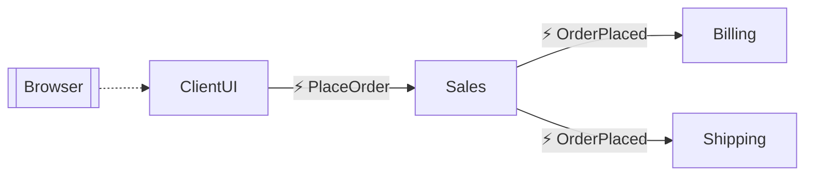

# nservicebus-azure-functions-demo

Demonstrates how to build and host NServiceBus-based services with Azure Functions and Azure Service Bus. [Official NServiceBus quick start solution](https://docs.particular.net/tutorials/quickstart/) migrated to [Azure Functions](https://learn.microsoft.com/en-us/azure/azure-functions/functions-overview) with [Azure Service Bus](https://learn.microsoft.com/en-us/azure/service-bus-messaging/service-bus-messaging-overview) used as messaging transport.




## How to run

As a prerequisite, you will need [Azure Functions Core Tools installed on your devbox](https://learn.microsoft.com/en-us/azure/azure-functions/functions-run-local#install-the-azure-functions-core-tools).

1. [Create an Azure Service Bus Namespace with Standard or Premium pricing tier](https://learn.microsoft.com/en-us/azure/service-bus-messaging/service-bus-quickstart-portal#create-a-namespace-in-the-azure-portal).

2. Install the [asb-transport](https://docs.particular.net/transports/azure-service-bus/operational-scripting) CLI tool.

3. Use that tool to pre-create required queues/topics:
```
set AzureServiceBus_ConnectionString=<my-service-bus-connection-string>
asb-transport endpoint create ClientUI
asb-transport endpoint create Sales
asb-transport endpoint create Billing
asb-transport endpoint create Shipping
```

4. Create another queue named `Wholesale` [manually](https://learn.microsoft.com/en-us/azure/service-bus-messaging/service-bus-quickstart-portal#create-a-queue-in-the-azure-portal), with **sessions enabled** on it:


5. Put your Azure Service Bus connection string into each project's `local.settings.json` file.

6. Start each Function project by running `func start` in its folder.

7. Navigate to `http://localhost:7071` with your browser.

    The `ClientUI` project is an Azure Function, but it also serves static HTML files for the [client-side React-based UI app](https://github.com/scale-tone/nservicebus-azure-functions-demo/tree/master/ClientUI-React), so there is no need to host them anywhere else.
